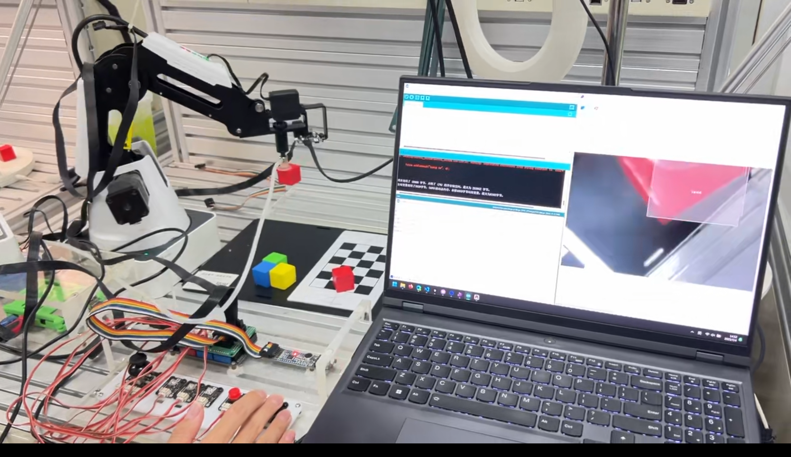

# Dobot-Select

### 项目概述

本项目旨在利用Dobot机械臂、Pixy2视觉识别模块和LD3320语音识别模块，实现一个简易的自动分拣系统。该系统能够通过颜色识别和语音指令控制，对不同颜色的方块进行自动抓取与放置。项目分为多个部分：视觉识别、语音控制和机械臂操作等，旨在展示机器人在自动化生产中的应用潜力。

### 环境配置

- **硬件平台**：基于Dobot Magician机械臂，搭载Pixy2视觉识别模块和LD3320语音识别模块。
- **开发环境**：Arduino IDE 1.8.19或更高版本，支持Dobot库的安装与配置。
- **依赖库**：需要安装并配置Dobot库、Pixy2库（用于颜色识别）、LD3320库（用于语音控制）。
  - Dobot库可从[官方GitHub](https://github.com/DobotCooperation/DobotDll)下载，按照说明进行编译和链接设置。
  - Pixy2库可通过Arduino库管理器搜索“pixy”获取。

### 源代码简介

- **Robot_Arm_Vision_Sorting.cpp**基于Pixy2视觉识别模块和LD3320语音识别模块，实现机械臂对不同颜色物块的自动分拣。集成了颜色识别、坐标变换和机械臂控制等功能。
- **Robotic_VoiceRecognition.cpp**基于LD3320语音识别模块，实现通过语音指令控制机械臂的移动和气泵（吸盘）的启停。支持"上升、下降、左转、右转、前进、后退、抓取、释放"等语音命令。
- **Robotic_LED_Control.cpp**通过摇杆模块和RGB按键模块，控制Dobot机械臂的LED灯光效果和气泵启停。包含LED闪烁、三色LED轮流点亮、遥感与按键优先级控制等多种模式。
- **Robotic_Arm_Joystick_Control.cpp**利用摇杆和按键模块，实现对机械臂XYZ三轴的手动控制，以及气泵（吸盘）的开关。支持速度调节、方向控制和吸附操作，适合手动搬运实验。
- **Robotic_Arm_Handling_Control.cpp**
  控制机械臂完成从A点到B点的自动搬运任务。通过Dobot库函数实现机械臂运动控制，并结合气泵实现物体的吸附与释放，适合基础自动搬运演示。
